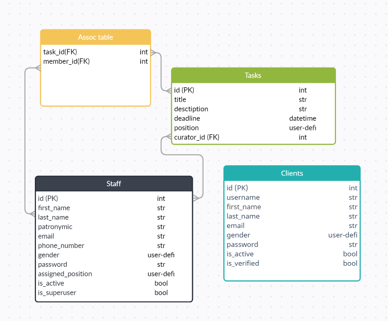

# CRM Prototype on FastAPI


<div>
  
  
  
  
  
  
  
</div>

## Deployment Linux
1. Setup [poetry](https://pypi.org/project/poetry/) and install requirements (`poetry install`)
2. Rename `.env.dist` to `.env` and configure it
3. Run virtual env with `poetry shell` command
4. Run database migrations with `make migrate` command
5. Run `make createsuperuser` to create superuser
5. Run server `uvicorn main:app --host 0.0.0.0 --port 80`

## Deployment via Docker
- Run `docker-compose up --build`

## Migrations
**Make migration script:**

    make migration message=YOUR_MIGRATION_MESSAGE_HERE

**Run migrations:**

    make migrate

## Running Tests

To run tests, run the following command

```bash
pytest tests
```

## Used Technologies

- [FastAPI](https://fastapi.tiangolo.com/)
- [SQLAlchemy](https://docs.sqlalchemy.org/en/20/orm/quickstart.html)
- [Pydantic](https://docs.pydantic.dev/latest/)
- [PostgreSQL](https://www.postgresql.org/)
- [Redis](https://redis.io/)
- [Celery](https://docs.celeryq.dev/en/stable/)
- [PyTest](https://docs.pytest.org/en/8.0.x/)

## Demo





## Authors

- [Kamran Pulatov(WrldEngine)](https://www.github.com/WrldEngine)